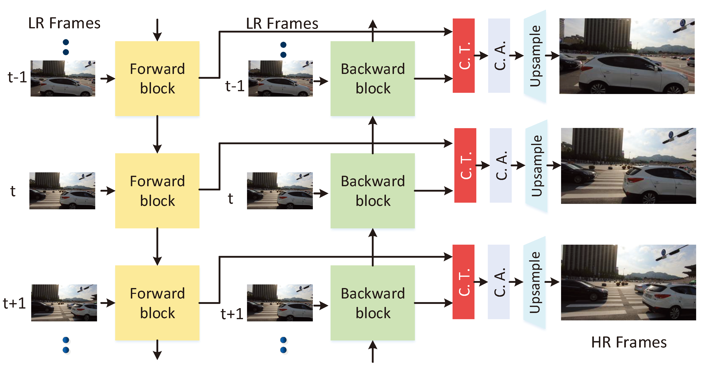

# CVSR:Complex-Valued Networks for Video Super-Resolution

Author : [Chuan Luo](https://orcid.org/0009-0000-7660-4239)


## Abstract
  > In video super-resolution (VSR), bidirectional sequences (i.e., forward and backward sequences) inherently describe the temporal flow and provide oriented motion information for high-resolution reconstruction. However, few works consider further modeling of bidirectional features, and they only aggregate these forward features and backward features into a group of ordinary feature maps via concatenation. Therefore, the correlation between the two features in opposite directions remains to be explored. In this paper, we provide a novel viewpoint for VSR, which constructs a higher relationship with respect to the forward features and backward features in the complex number domain. We respectively treat a forward feature and a backward feature as the real component and the imaginary component of a complex number and compute them according to the rules of complex number. This computation allows the bidirectional features to embrace a more coupling relation, so as to excavate high-dimension information used for reconstruction. Specifically to achieve complex VSR framework, we present two transplantable modules, i.e., complex transform and complex attention. The complex transform aims to generally change the bidirectional features to complex features by constructing a complex feature extraction. The complex attention can adaptively rectify the complex features for each complex feature map, so as to project a feature map to a specific frequency. In addition, we analyze the superiority of complex representations compared with real-valued representations. Extensive experiments on representative bidirectional networks (BasicVSR and IconVSR) and their improved form (IBRN) show the effectiveness and robustness of complex VSR framework.

## News
* [2025.07.02] Submission accepted
* [2025.06.24] Releases code
* [2025.03.20] UNDER REVIEW
* [2025.02.14] First submitted

## Framework of CVSR



## Usage
### Dataset Preparation

- Please refer to **[DatasetPreparation.md](docs/DatasetPreparation.md)** for more details.
- The descriptions of currently supported datasets (`torch.utils.data.Dataset` classes) are in [Datasets.md](docs/Datasets.md).

### Dependencies and Installation

- Python >= 3.8 (Recommend to use [Anaconda](https://www.anaconda.com/download/#linux) or [Miniconda](https://docs.conda.io/en/latest/miniconda.html))
- [PyTorch >= 2.1](https://pytorch.org/)
- NVIDIA GPU + [CUDA](https://developer.nvidia.com/cuda-downloads)

1. Clone repository

    ```bash
    git clone https://github.com/ttcluo/CVSR.git
    ```

2. Install dependent packages

    ```bash
    cd CVSR
    pip install -r requirements.txt
    ```

3. Compile basicsr environment

    ```bash
    python setup.py develop
    ```
    or
   
   ```bash
   pip install basicsr
   ```

### Training
```bash
# train on vimeo-90k
sh script/dist_train.sh options/train/CVSR/train_CIBRN_Vimeo90k_b6.yml

# train on RealVSR
sh script/dist_train.sh options/train/CVSR/train_CIBRN_REAL_YCbCr.yml
```

### Test
```bash
# test on Vimeo90K-T
sh script/dist_test.sh options/test/CVSR/test_CIBRN_Vimeo90k-T.yml

# test on vid4
sh script/dist_test.sh options/test/CVSR/test_CVSR_Vid4.yml

# test on RealVSR
sh script/dist_test.sh options/test/CVSR/test_CIBRN_REAL_YCbCr.yml
```

### Pretrained Model
[Pretrained Model](experiments/models)

## Acknowledgement

Our code is built upon [BasicSR](https://github.com/XPixelGroup/BasicSR), which is an open-source image and video restoration toolbox based on [PyTorch](https://pytorch.org/). Thanks to the code reference from:

- [IBRN_VSR](https://github.com/hengliusky/IBRN_VSR)
